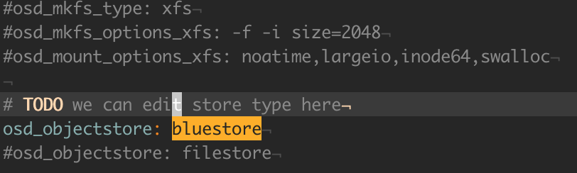
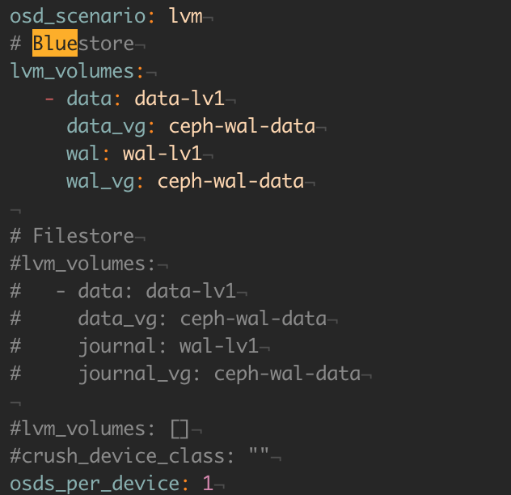
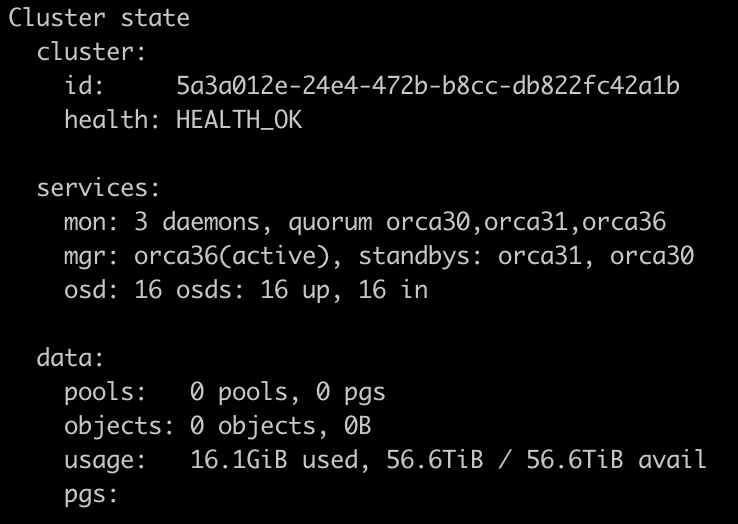
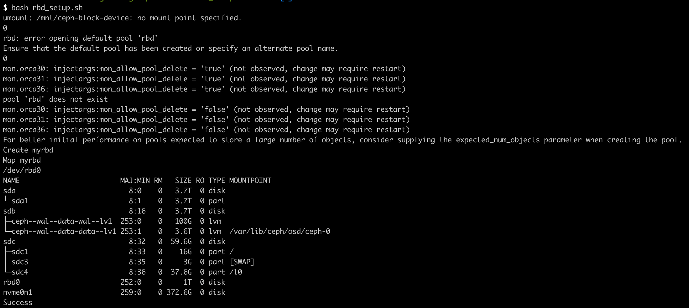
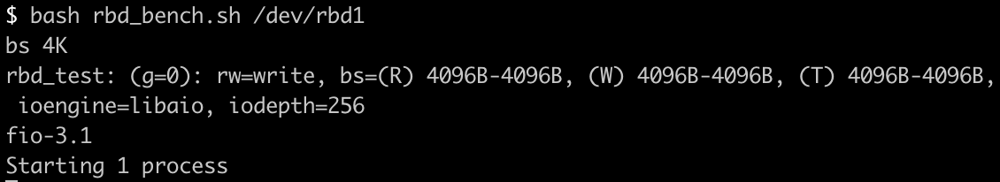

# Experiments
This document describes how to run the experiments contained in the submission.
There are two logical groups of experiments: with and without a cluster
deployment.
Figure 3 is a simulation, and therefore does not require a cluster.
The rest of the figures utilize a 16 node Ceph cluster with either a HDD or SSD
(specifically NVMe) backing the Ceph OSDs.
Replicating the cluster setup is the most challenging part of running these
experiments --- once a cluster is setup, the benchmarking scripts are relatively
easy to use.

The experiments were originally run using [ceph-deploy](https://docs.ceph.com/docs/master/rados/deployment/).
However, we also include a
[ceph-ansible](https://docs.ceph.com/ceph-ansible/master/installation/methods.html) setup that should reproduce the
results (found in the `ceph-ansible` directory).
To deploy with ansible, run:
```bash
./init_repo.sh
```
from the root directory.
This script has a parameter to choose SSD (NVMe) or HDD, but changing the
backend from FileStore to BlueStore requires editting the ansible configuration
(in `group\_vars/all.yml` and `group\_vars/osds.yml`).
The `Ceph\_Deploy\_Install\_Scripts` directory contains ceph-deploy scripts.
The changes in `group\_vars/all.yml` are as follows:


The changes in `group\_vars/osds.yml` are as follows:


If using ceph-deploy, we recommend reading the documentation before running
experiments.
These can be found
[here](https://docs.ceph.com/docs/luminous/rados/deployment/).

Once your cluster is installed, you should check the status of your cluster.
```bash
ceph -s
```

The status should look something like the following:



## Figure 3 (Overhead of running object store on journaling file system)
Here we measure the overhead of running an object store on top of a journaling
file system.
We construct this benchmark in the Journaling\_Tests directory.
To run the tests, simply run
``
./install_deps && make && ./run_test_hdd.sh && ./run_test_ssd.sh
``
We provide more comprehensive instructions in the
[Journaling_Tests/README.md](Journaling_Tests/README.md) file in that directory.


## Figure 4 (The effect of directory splitting on throughput)
Here we measure 4KiB RADOS writes with Filestore and observe that directory
splitting causes a reduction in throughput.
The scripts for running these benchmarks are in the `Cluster\_Bench\_Scripts/`
directory (scripts of the form `benchmark\_micro\_\*` are RADOS benchmarks).


## Figure 7 (The throughput of steady state object writes to RADOS)
Here we measure the write throughput of RADOS with Filestore compared to
BlueStore.
Throughput is evaluated at various object sizes.
The scripts for running these benchmarks are in the `Cluster\_Bench\_Scripts/`
directory.


## Figure 8 (The throughput of 4 KiB RADOS object writes to RADOS)
Here we compared 4KiB RADOS object writes.
This figure contains plots from Figure 4 as well as the corresponding BlueStore results.
The scripts for running these benchmarks are in the `Cluster\_Bench\_Scripts/`
directory.


## Figure 9 (The throughput of variable-sized RBD object writes)
Here we measure the write throughput of RBD with Filestore compared to
BlueStore.
Throughput is evaluated at various object sizes.
Results shown are for the HDD cluster.

We use the Flexibile I/O tester (FIO) tool to perform our benchmarks.
Running the tests means we need to locally mount a block device from Ceph.

RBD creation scripts are in `RBD\_Setup/`.
Erasure coding parameters (e.g., k and m) can be found in the `ec\_rbd\_bench.sh`
scripts.
Mounting a RBD device successfully should result in something as follows:


The scripts for running these benchmarks are in the `Cluster\_Bench\_Scripts/`
directory (`ec\_rbd\_bench.sh` or `rbd\_bench.sh`).
The scripts are given the rbd device as an argument.

For example, if the rbd device is name rbd0, you can do the following:
```bash
./rbd_bench.sh /dev/rbd0
```

If you mount multiple RBD devices, you'll get higher numbered rbd devices.
In the following case, we use rbd1.



## Figure 10 (The IOPS of random 4 KiB writes to RBD with Replication and EC)
Here we measure the IOPS from 8 clients to RBD.
Results shown are for the HDD cluster.
The scripts for running these benchmarks are in the `Cluster\_Bench\_Scripts/`
directory, although they do require testing 8 clients in parallel rather than 1.
RBD creation scripts are in `RBD\_Setup/`.

To do the parallel run setup, run the setup script to create a replicated or EC RBD.
You can continue to mount rbd devices on a node as follows:
```bash
sudo rbd map myrbd
```

Running the test is parallel can be done as it is done in the scripts from Figure 9.
However, the tests must be started in parallel.
We mounted all 8 devices on the same node in our experiments.
